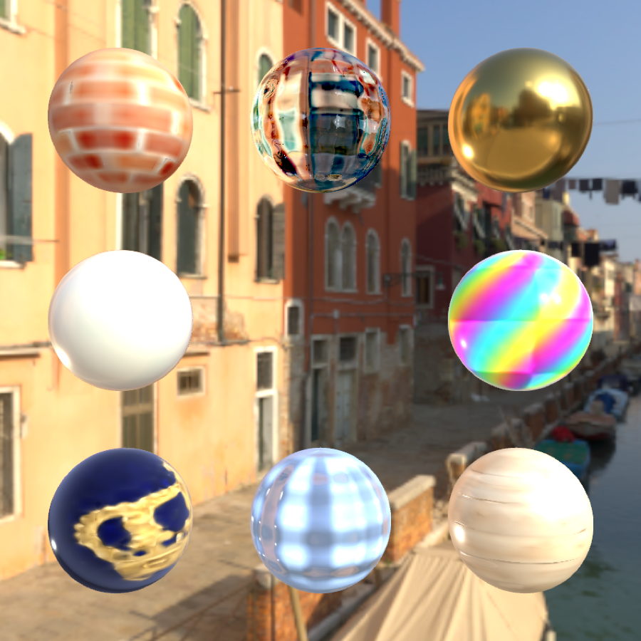

# three-ntc

[](https://www.npmjs.com/package/three-ntc)
[](https://www.npmjs.com/package/three-ntc)
[](https://github.com/bhouston/three-ntc/actions/workflows/ci.yml)
[](https://three-ntc.ben3d.ca)

Neural Texture Compression runtime for three.js — load `.ntc` files and get back a standard
`MeshPhysicalNodeMaterial` (via TSL) that decodes a compact grid + MLP model on the GPU.



An implementation of NVIDIA's 2023 [Neural Texture Compression](https://research.nvidia.com/labs/rtr/neural_texture_compression/)
paper: NTC jointly fits a material's whole texture stack — albedo, normal, roughness, metalness,
and more — into a single grid + MLP model instead of one texture per channel. Every material
pictured above is about 93KB total, often smaller than a single texture from the original
material, for a fraction of the memory and download cost of standard PBR textures.

Try it live at **[three-ntc.ben3d.ca](https://three-ntc.ben3d.ca)**.

`.ntc` models are trained with the companion [`three-ntc-trainer`](https://www.npmjs.com/package/three-ntc-trainer) package.

## Install

```bash
npm install three-ntc
```

## Usage

```js
import { NTCLoader, NTCNodeMaterial } from 'three-ntc';

const loader = new NTCLoader();
const { cpuModel, channelClassification } = await loader.loadAsync('gold.ntc');

const material = new NTCNodeMaterial(cpuModel, channelClassification);
const mesh = new THREE.Mesh(geometry, material);
```

`NTCNodeMaterial` extends three.js's `MeshPhysicalNodeMaterial`, so it drops straight into an
existing WebGPU renderer scene alongside ordinary materials.

## Runtime sampling

```ts
const material = new NTCNodeMaterial(cpuModel, channelClassification, {
  samplingMode: 'nearest', // default
  lodBias: 0,
});

// Live uniform changes: no material or shader rebuild.
material.setSamplingMode('stochastic'); // or 'nearest' / 'trilinear'
material.samplingMode = 'nearest';     // equivalent property setter
material.setLodBias(1);                // positive bias selects finer mips
```

| Mode | MLP evaluations per material sample | Behavior |
| --- | --- | --- |
| `nearest` | 1 | Reconstruct the nearest physical texel at the nearest mip. |
| `stochastic` | 1 | Randomly select a texel and mip with trilinear sampling probabilities. Noise varies by screen pixel and frame. |
| `trilinear` | 8 | Reconstruct and blend four texels at each of two mip levels. |

Stochastic sampling follows the paper's UV/LOD jitter approach. It introduces noise;
this library and the website currently apply no temporal reconstruction. Its expected
material-channel values match trilinear filtering, but averaging shaded samples is
not equivalent to shading averaged material channels. Add a temporal resolve in the
renderer when using this mode for stable images.

The old `interpolation` option and `setInterpolation()` have been replaced by
`samplingMode` and `setSamplingMode()`. Sampling controls runtime reconstruction,
not the training model or its learned G0/G1 feature interpolation. Settings are not
stored in `.ntc` exports. `setLodBias()` affects automatic LOD only; an explicit
constructor `lodNode` takes precedence. The website viewer and trainer preview both
expose sampling and LOD bias controls and start with nearest sampling.
